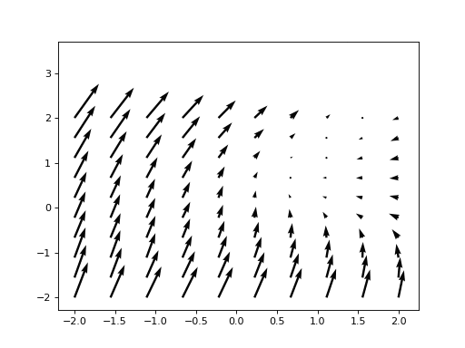

Deep Learning based policy to solve control problems 
======

We use Pontryagin Maximum principle to solve a contol problem with the python module [torchdiffeq](https://github.com/rtqichen/torchdiffeq).

The script `lqr.py` solves the linear-quadratic control problem


with utility function


where `C,D,R` are positive semi-definite matrices of size `(d,d)` where `d` is the dimension of the process `X_t`. After solving the problem in the time interval `[0,5]`, and sampling X_0 from N(0,2)

### Running the script
  ```
  usage: lqr.py [-h] [--base_dir BASE_DIR] [--device DEVICE] [--use_cuda]
                [--seed SEED] [--batch_size BATCH_SIZE] [--d D]
                [--hidden_dims HIDDEN_DIMS [HIDDEN_DIMS ...]] [--n_iter N_ITER]
                [--T T] [--steps STEPS] [--step_size_solver STEP_SIZE_SOLVER]
                [--visualize]
  ```


- Example Training:
```
 python lqr.py --d 2 --use_cuda
```
 - Visualizing the results:
 ```
 python lqr.py --d 2 --visualize
 ```


<p align="center">

</p>
